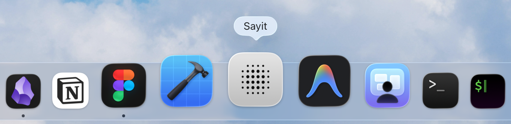

# Sayit

Push-to-talk voice dictation for macOS.

> 如果你只是想下载安装，直接点下面这个按钮。

  

**支持系统：Apple Silicon + macOS 14+**

## 快速开始

1. 点击上面的下载按钮。
2. 下载最新 zip。
3. 解压后把 `Sayit.app` 拖到 `Applications`。
4. 从 `Applications` 打开 `Sayit.app`。

如果 macOS 拦截：

1. 打开 `系统设置 -> 隐私与安全性`
2. 在页面底部找到和 `Sayit` 相关的提示
3. 点击 `仍要打开`

## 这是什么

Sayit 是一个 macOS 菜单栏语音输入工具。

你按一次 `Fn` 开始录音，再按一次 `Fn` 结束录音。  
Sayit 会把识别出的文字直接输入到你当前正在使用的应用里。

支持的场景包括：

- 日常中文听写
- 中英夹杂输入
- AI / 设计 / 互联网工作流里的专业词
- 云端高精度听写
- 本地听写

## 适合谁

如果你经常在这些应用里输入文字，这个工具会比较合适：

- ChatGPT / Claude / Codex
- Notion / Obsidian
- Figma / FigJam
- 终端 / 编辑器 / IM

## 系统要求

- Apple Silicon Mac：M1 / M2 / M3 / M4
- macOS 14 或更高版本

当前不支持：

- Intel Mac
- macOS 13 及以下

## 第一次使用

第一次启动时，Sayit 会自动请求这些权限：

- 麦克风
- 输入监听
- 辅助功能

没有这些权限时：

- 不能录音
- 不能监听 `Fn`
- 不能把文字自动输入到当前应用

默认听写模式是：

- 本地 `medium`

因为公开下载包里**不内置本地模型**，所以如果这台机器上还没有本地模型，第一次打开时 Sayit 会：

1. 自动弹出提示
2. 自动开始后台下载本地 `medium` 模型
3. 下载完成后直接可用

也就是说，新用户**不用先自己去菜单里找模型**。

如果自动下载失败：

1. 打开菜单栏里的 `Sayit`
2. 进入 `听写 -> 本地`
3. 再点一次 `medium`

这会直接重试下载。

## 听写模式

Sayit 支持多条听写路线：

- 本地听写
- Groq
- ElevenLabs
- 豆包-2.0
- 豆包

默认包里**不内置本地模型**。  
如果这台机器上还没有本地模型，第一次打开时就会自动提示并开始下载。

## 如果 Fn / Globe 键没反应

有些机器上，`Fn` 或 `Globe` 键会被 macOS 或其他工具占用。

最常见的情况是：

- macOS 把它拿去做输入法切换
- macOS 把它拿去做 Emoji / 表情与符号
- macOS 把它拿去做系统听写
- 第三方工具把它绑定成快捷键  
  例如：
  - Raycast
  - Karabiner
  - BetterTouchTool
  - Logi Options

如果你按 `Fn` 没反应，先这样检查：

1. 打开 `系统设置 -> 键盘`
2. 找到和 `Fn` / `Globe` 键行为相关的设置
3. 把它改成：
   - `不执行任何操作`
   - 或至少不要占用它做输入法、表情、系统听写切换
4. 如果你装了快捷键工具，也检查里面有没有占用 `Fn`
5. 改完之后，再回到 Sayit 重试

## 改写模式

Sayit 支持：

- 原样直出
- 本地规则轻修正
- Groq 改写

如果你没有配置云端凭证，也可以直接用。

## 云服务凭证

如果你想用云端听写或改写，需要在 app 里填写你自己的凭证。

这份公开下载包：

- **不包含**作者自己的 API key
- **不包含**作者自己的本地术语库
- **不包含**作者自己的本地模型

## 更新方式

以后想拿最新版本，直接打开这个链接就行：

- [最新版 Release 页面](https://github.com/harperrrdesign/Sayit/releases/latest)

## 说明

这是一个持续迭代中的版本。  
如果你在某个特定应用里遇到输入异常，通常和该应用的输入框实现、权限或系统环境有关。
